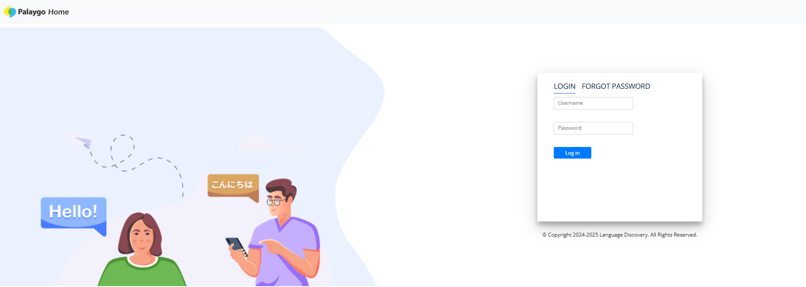
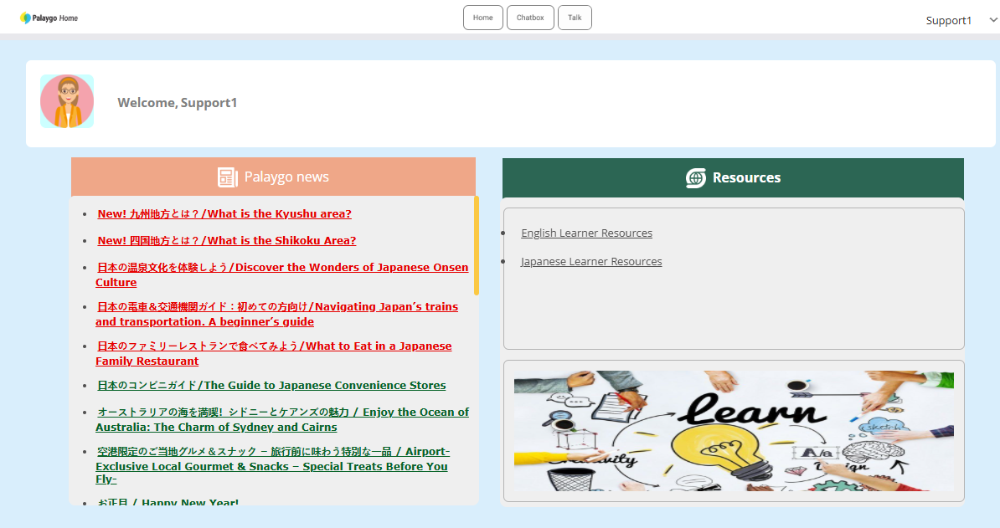
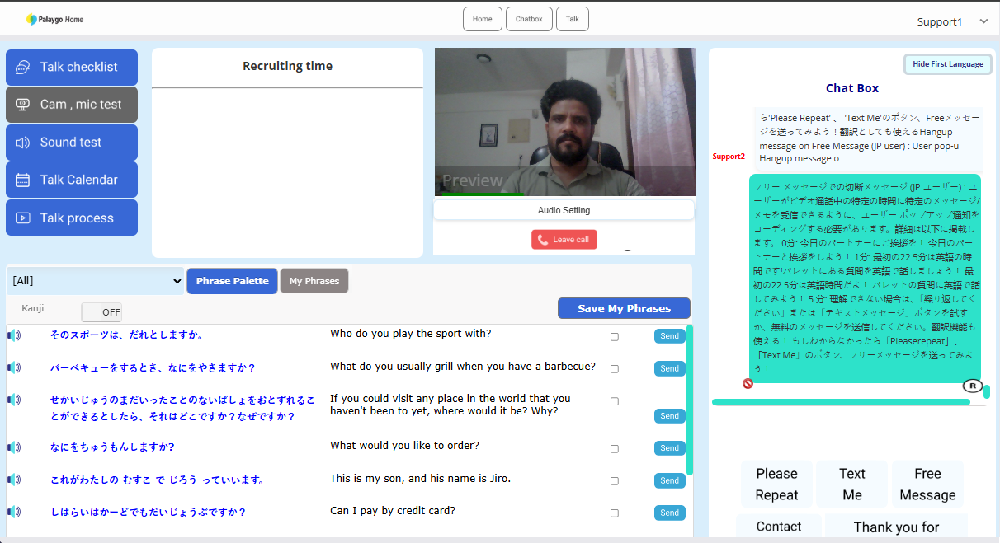
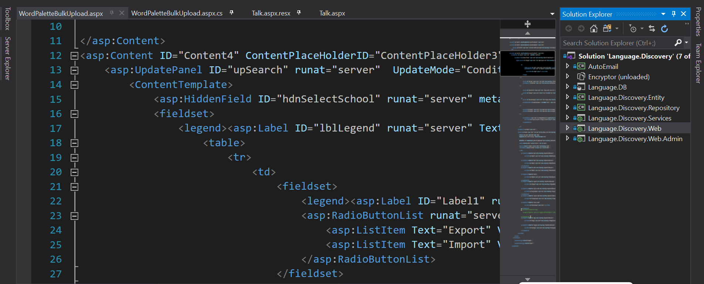
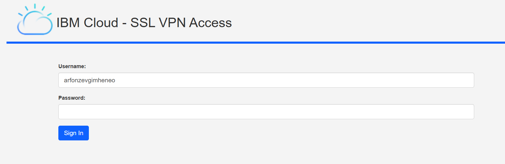
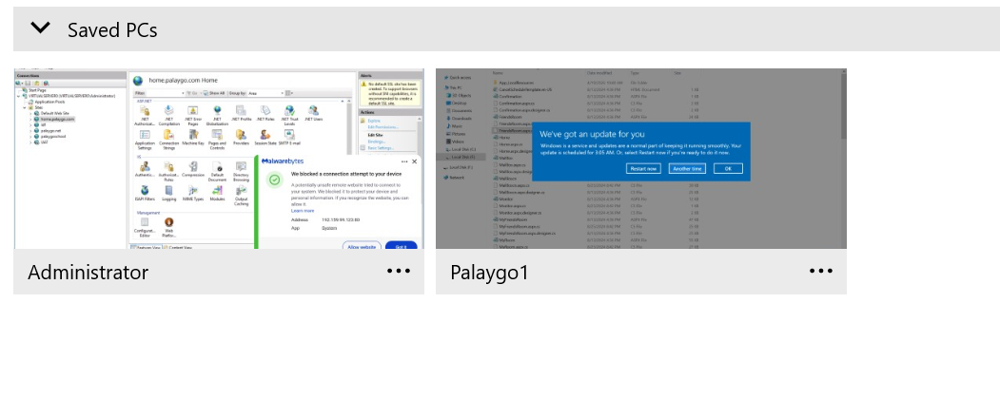
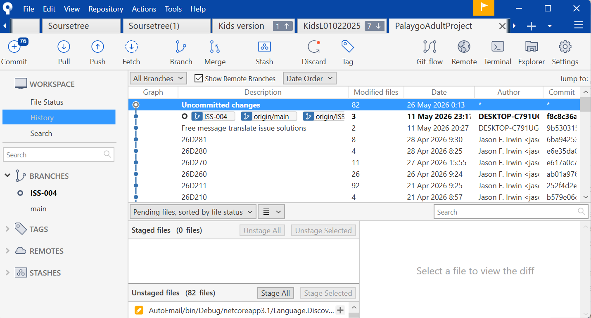

# Enterprise Learning Communication Platform Demo

  

Developed and maintained a cloud-based enterprise ASP.NET WebForms application for an Australian client. Worked on frontend, backend, SQL Server database management, IIS deployment, SSL configuration, and production support using IBM Cloud infrastructure.

---

# Tech Stack

- ASP.NET WebForms
- C#
- SQL Server
- JavaScript
- jQuery
- Bootstrap
- IIS
- IBM Cloud
- SSL VPN
- Bitbucket
- Sourcetree
- Visual Studio 2019

---

# Features

- Enterprise layered architecture
- Frontend and backend integration
- SQL Server database management
- IIS deployment and hosting
- SSL certificate configuration
- Cloud-based server management
- Git workflow using Sourcetree & Bitbucket
- Production support workflow

---

# Project Architecture

- Web Layer
- Services Layer
- Repository Layer
- Entity Layer
- Database Layer
---
# System Architecture

Client Browser
   ↓
ASP.NET WebForms UI
   ↓
Service Layer
   ↓
Repository Layer
   ↓
SQL Server Database
   ↓
IBM Cloud Windows Server + IIS

---

## Login Page

---

## Dashboard

---

## Communication Module

---

## Enterprise Solution Architecture

---

## IBM Cloud SSL VPN Access

---

## IIS Deployment Environment

---

## Git Workflow Using Sourcetree

---

## Deployment Workflow

- Development using Visual Studio 2019
- Source control using Bitbucket & Sourcetree
- Deployment to IBM Cloud Windows Server
- IIS configuration and SSL binding
- Production monitoring and maintenance
  
---

## Responsibilities Demonstrated

- Full Stack ASP.NET Development
- SQL Server Database Management
- IIS Hosting & Deployment
- SSL Certificate Configuration
- IBM Cloud Infrastructure Access
- Git Version Control Workflow
- Enterprise Application Maintenance
- Production Environment Support
- Foreign Client Communication

---

## Disclaimer

This repository is a demo portfolio project created to demonstrate enterprise ASP.NET development experience and deployment workflow.  
No confidential client source code or sensitive production information is included.
